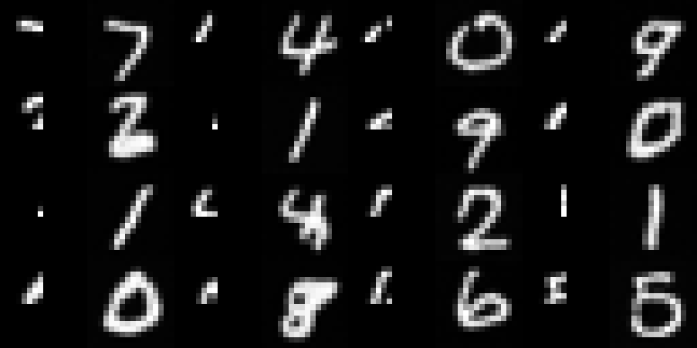

# diffusion_playground
My first Diffusion Excercise

## (unet.py) UNetModel Architecture
[UNet Architecture](https://drive.google.com/file/d/1I1EhNBxtHDe7Mv3ZEcj7eNH3PMD50GHn/view?usp=sharing)
(Author: [Seungyong Lee](https://github.com/seungyonglee0802))


## How to Run this demo
install requirements
```bash
pip install -r requirements.txt
```

run
```bash
python ddpm.py
```

## Demo History
### ✅ Demo 1: Enable Diffusion Model


### ✅ Demo 2: Add initial condition (i.e. `guide`) with channel-wise concatenation

* left: guide, right: generated image

1. Full guide


2. Half (Top) guide


3. Quarter (Top-Left) guide




### ✅ Demo 3: Add embedding condition in ResBlock

1. Quarter (Top-Left) guide with class embedding


Model could generate MNIST image with given label (class) embedding. 

### ✅ Demo 4: Add context condition in TransformerBlock

* left: guide, middle: context, right: generated image

1. Quarter (Top-Left) guide with class embedding and context condition

Using simple `resnet` as context encoder.


Model could generate MNIST image with given label (class) embedding and context condition.


## References
[ComVis/latent-diffusion](https://github.com/CompVis/latent-diffusion)

[JiHeon's Diffusion Tutorial](https://github.com/JeongJiHeon/ScoreDiffusionModel)